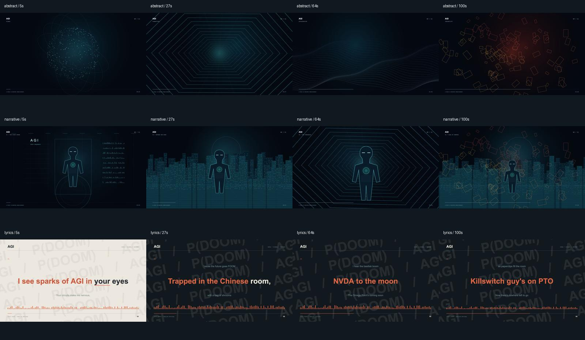

# I'm Upping My P(doom) · Video workspace

以 **作品 → 制作版本 → 变体与交付记录** 为核心的代码视频创作仓库。首个作品是 **AGI**：保留参考视频提取的完整音轨，按独立制作版本探索不同的视觉处理。后续类似视频使用独立作品目录；没有固定的前端项目。

目前有 **2 个独立参考**：`LLMV_001 / AGI`（B 站，约 2:37）与 `LLMV_002 / anabology`（X，1080p24，约 5:06）。新参考单独保存在 [projects/anabology/](projects/anabology/REFERENCE.md)，仅登记原片与来源，没有制作版本；原片和内嵌音轨完整保留在本地。两条参考的目录、输入 ID 和制作记录独立，目录见 [docs/REFERENCES.md](docs/REFERENCES.md)。



## 现有内容

| 作品 | 版本 | 变体 | 状态 |
| --- | --- | --- | --- |
| AGI / LLMV_001 | v001 | 科幻抽象、AGI 觉醒叙事、歌词视觉 | review |
| AGI / LLMV_001 | v002 | 参考引擎、原生 4K60 技术迁移 | review |
| AGI / LLMV_001 | v003.0 | 失控的计算温室 · 首轮 Preview | superseded |
| AGI / LLMV_001 | v003.1 | 失控的计算温室 · 排版修订 | review |
| AGI / LLMV_001 | v004.0 | 谁在控制谁 · 逐句控制剧场 | review |
| AGI / LLMV_001 | [v006.0](projects/agi/versions/v006.0/TREATMENT.md) | **特殊衍生视频：原片解梗伴看，非原片重渲染** | draft · 仅三张 review 样图 |
| AGI / LLMV_001 | [v006.1](projects/agi/versions/v006.1/TREATMENT.md) | 原片解梗伴看 · 右侧缩字，保留上一条完整解释 | draft · 静态修订样图 review |
| AGI / LLMV_001 | [v006.2](projects/agi/versions/v006.2/TREATMENT.md) | 原片解梗伴看 · 左下中英歌词对照，延续右侧连续阅读 | draft · 静态修订样图 review |
| AGI / LLMV_001 | [v006.3](projects/agi/versions/v006.3/TREATMENT.md) | 原片解梗伴看 · 右侧对应歌词＋具体梗解释 | draft · 静态修订样图 review |
| AGI / LLMV_001 | [v006.4](projects/agi/versions/v006.4/TREATMENT.md) | 原片解梗伴看 · 放大原片、缩小左下双语字幕 | draft · 静态修订样图 review |
| AGI / LLMV_001 | [v006.5](projects/agi/versions/v006.5/TREATMENT.md) | 原片解梗伴看 · 移除视频框内标签栏，原片填满窗口 | draft · 静态修订样图 review |
| AGI / LLMV_001 | [v006.6](projects/agi/versions/v006.6/TREATMENT.md) | 原片解梗伴看 · 删除顶部辅助标签，仅保留歌名 | draft · 静态修订样图 review |
| AGI / LLMV_001 | [v006.7](projects/agi/versions/v006.7/TREATMENT.md) | 原片解梗伴看 · 右侧文字再微缩一档，保留完整前后解释 | draft · 静态修订样图 review |
| AGI / LLMV_001 | [v006.8](projects/agi/versions/v006.8/TREATMENT.md) | 原片解梗伴看 · 原生 4K60 字幕与滚动注释合成 | draft · 首次完整导出失败，未重试 |
| AGI / LLMV_001 | [v006.9](projects/agi/versions/v006.9/QA.md) | 原片解梗伴看 · 修正内存保留，完整 4K60 成片 | review · 媒体与播放检查通过 |
| AGI / LLMV_001 | [v006.10](projects/agi/versions/v006.10/QA.md) | 原片解梗伴看 · 中英关键词高亮与全宽进度条 | review · 完整视频与交互审看片页 |
| AGI / LLMV_001 | [v006.11](projects/agi/versions/v006.11/TREATMENT.md) | 原片解梗伴看 · 进度条贴底，取消单独底栏 | draft · 仅一张 4K 样图，等待用户审看后再制作全片 |
| AGI / LLMV_001 | [v006.12](projects/agi/versions/v006.12/TREATMENT.md) | 原片解梗伴看 · 根据红框收紧字幕与时间间距 | draft · 单帧 review，完整视频等待确认 |
| AGI / LLMV_001 | [v006.13](projects/agi/versions/v006.13/QA.md) | 原片解梗伴看 · 正式稿 · 完整 4K60 成片 | approved · 用户于 2026-10-04 确认 |

**V006「原片解梗伴看」**以原视频为主体，新增中文梗解释、双语字幕和滑动注释，不重新制作原 MV 的场景。原片抽查未发现外部水印，直接解码嵌入新画布。[v006.13 正式稿](projects/agi/versions/v006.13/outputs/LLMV_001_V006_R013_001_companion_v006.13.mp4) 为 3840×2160、60fps、约 2 分 37 秒，完整复制原 AAC，已由用户确认并登记为 approved；采用用户确认的 v006.12 紧凑底部布局，保留中英关键词橙色高亮与贴底全宽进度条。

最新成片覆盖 46 句中英歌词和 43 次注释出现，保留完整上一条与当前条。v006.13 的渲染代码与获批样图一致，字幕、时间和右下提示的间距按确认版执行。另附 [watch.html 审看片页](projects/agi/versions/v006.13/watch.html)，在临时预览服务中可直接点击、拖动贴底进度条。详见 [最新交付与验收](projects/agi/versions/v006.13/QA.md)和[正式稿确认记录](projects/agi/versions/v006.13/provenance/USER_FINAL_APPROVAL.json)；确认绑定已交付 MP4 的 SHA-256，成片内容保持不变。

[40 条解梗稿 v003](docs/plans/agi-v006-annotation-review-v003/REVIEW.md)覆盖 46 句主歌词，另含 3 条片尾画面解释。原 40 条梗解释已由用户于 2026-10-04 确认；现有 [29 条简短年份与具体来源](docs/plans/agi-v006-annotation-review-v003/ALL_CONTEXT.md)，其中[新增 10 条](docs/plans/agi-v006-annotation-review-v003/SOURCE_NOTES.md)，包括 Astra 使用超过 10 万块 GPU 训练的现实对照。背景已纳入 v006.8 的简短屏幕文案，原审稿完整保留；不将旧稿确认扩展为新画面或同步批准。

v001 的三种变体均为 **1920×1080、24fps、约 2 分 37 秒**，完整复用原 AAC 音轨。参考原片、M4A 原音频、WAV 编辑音频和三部 MP4 在本地完整保留；GitHub 上传画面静帧、源代码、歌词对齐数据、转录、媒体探测和原 Story Studio 验收记录。

v002 已采用参考项目的 **TypeScript＋Three.js／WebGL、22 段场景、歌词／节拍时间线、HDR 后期、自适应运动模糊及有背压的 RGBA/WebSocket 导出**。实际出帧规格为 **3840×2160、60fps**，完整音轨对应 9400 帧；旧 v001 保留。v002 完整候选已登记为 review，规格、解码和原音轨一致性检查通过，人工审美和有声同步仍待审看。

最新完整 Preview 为 **v004.0「谁在控制谁」**：1920×1080、CFR 30fps、固定 4 次时间采样、4700 帧，完整原 AAC 音轨；46 句全文字幕、逐句机械／图解语义事件与四遍不同副歌。单次整片渲染约 3 分 28 秒，完整解码、均匀帧时间戳和播放／跳转通过。方案见 [TREATMENT](projects/agi/versions/v004.0/TREATMENT.md)，交付说明见 [VERSION](projects/agi/versions/v004.0/VERSION.md)。

复用制作方法见 [歌词视频 Skill](.agents/skills/lyric-code-video/SKILL.md)。离线 Preview 默认为 1080p30／固定四次采样；正式成片默认为原生 4K60，采样策略按新版本单独设置。

当前 WAV 已实际重新执行 **Demucs 四分轨、mel-band-roformer 主唱分离、MMS_FA＋wav2vec2 的多声道 CTC 强制对齐、Whisper 交叉检查、人声音高／起音分析、节拍／重拍／鼓起音及 100Hz 分轨包络**。自动时点仍须人工听辨，记录见 v002/runs。

Vite 仅编译版本内代码，构建结果在忽略的 .cache，预览使用系统分配端口。仓库继续按作品与版本组织。

## 获取与检查

源码检查需要 Node.js 22+。媒体核验和渲染另需本地原始音视频、ffmpeg／ffprobe。

```sh
git clone https://github.com/firefighter-eric/im-upping-my-pdoom.git
cd im-upping-my-pdoom
npm ci
npm run check
npm test
npm run verify:source
npm run catalog
```

根据 2026-10-02 用户要求，GitHub 不包含视频、音频或其 LFS 指针；Git 和 ZIP 下载都只包含代码、字体／图片、分析数据与制作记录。媒体路径、规格与 SHA-256 仍保留，可追溯到本地原始文件。已有原始文件须按 project.yaml／manifest 映射放回对应路径；本仓库不提供媒体下载。批量诊断静帧 `stills/RUN_*/` 和缓存只在本地保留，其执行记录与哈希继续追踪；正式海报、字体和渲染器图片资产随代码上传。

恢复本地媒体后运行：

```sh
npm run verify
npm run verify:media -- --project agi --version v001
npm run verify:playback -- --project agi --version v001
```

CI 只验代码、版本资料和非媒体原始文件；不替代完整素材哈希校验或本地媒体验收。LFS 扩展配置仅保留为将来明确授权媒体发布时的保护。

首次代码上传的提交、远端树、文件体积、媒体排除清单和 CI 验收见 [`docs/github-publication-v001.json`](docs/github-publication-v001.json)。记录只对应首次上传，不作为视频候选的人类批准。

## 结构

```text
projects/
  agi/
    project.yaml                 # 作品身份、来源与原始输入
    sources/
      references/                # 不可覆盖的参考原片
      audio/                     # 原始 M4A 与编辑 WAV
      analysis/                  # 来源、探测与海报
      asset-original-v001.yaml   # 旧资产登记的原样副本
    versions/
      v001/
        manifest.json            # 此版本完整制作与交付登记
        TREATMENT.md             # 视觉处理、提示词与范围
        renderer.html            # 此版本的独立画面代码
        data/                    # 音频特征、歌词逐词时间
        outputs/                 # 三部完整视频，仅本地保留，Git 忽略
        runs/                    # 后续执行记录与实际哈希
        provenance/original/     # 迁移前完整历史证据，不执行
scripts/                         # 通用作品、版本、预览、渲染与核验工具
templates/                       # 新作品的接口骨架，创意为 TBD
docs/                            # 版本协议、迁移清单、制作决定
archive/story-studio/             # 与 AGI 有关的历史集成上下文
AGENTS.md                        # 人与代理的协作规则
```

原文件从 AI Short Drama 工作区复制，原位置仍保留。55 个原始文件逐字节校验，映射和 SHA-256 在 [`docs/migration-manifest-v001.json`](docs/migration-manifest-v001.json)。

## 按版本制作

### 查看某个版本

```sh
npm run preview -- --project agi --version v001 --variant abstract --time 46
```

命令启动临时只读服务并输出该版本画面与成片 URL；默认由系统分配空闲端口，结束可按 Ctrl+C。渲染器页面用于画面审看，完整声音与视频请打开打印出的 MP4 URL。需要固定端口时显式传 `--port 4173`，占用会直接报错。

### 预览 Three.js 版本与创建下一版本

```sh
npm run preview -- --project agi --version v004.0 --time 23
npm run build:renderer -- --project agi --version v004.0
npm run version:new -- --project agi --from v004.0 --version v004.1
```

v004.1 继承完整的 renderer/ TypeScript 模块、字体与资源、音频分析工具代码以及数据映射；成片、运行记录和人类批准独立。

### 从历史 Canvas 版本另建分支

```sh
npm run version:new -- --project agi --from v001 --version v005.0
```

此例从历史版本开启新的创意主版本；版本号必须大于现有所有版本。继承输入映射、数据和渲染代码，新版本从 `draft` 开始。编辑 `v005.0/TREATMENT.md`、`manifest.json` 和 `renderer.html`；旧版本的输出、批准状态和执行记录不复制。若修改代码或参数，应先更新该 draft manifest 中对应哈希与规格，再执行检查。

```sh
# 首次使用：安装 Playwright Chromium；本机已有 Chrome 时可用 --browser chrome
npx playwright install chromium
npm run render:smoke -- --project agi --version v004.1
npm run render:stills -- --project agi --version v004.1
npm run render -- --project agi --version v004.1
npm run register -- --project agi --version v004.1
npm run verify:media -- --project agi --version v004.1
```

以上渲染命令针对刚创建并填写好方案、参数与哈希的 v004.1 draft；已交付的 review／superseded 版本不能再次完整渲染。

`render` 默认输出该版本全部变体，也可传 `--variant abstract`。不会覆盖已有输出；失败记录后停止。`register` 必须有每个变体的成功执行记录，并验证哈希、全片帧数、音轨一致和完整解码，随后登记为 `review`。Smoke 输出在 `.cache/`，不算完整交付。

### 新建其他作品

```sh
npm run project:new -- --slug new-film --id VIDEO_002 --title "新作品"
```

创建 `projects/new-film/project.yaml` 和 `versions/v001/`，默认原生 4K60 的 TypeScript＋Three.js／WebGL 接口骨架；创意、Prompt、音频映射、模型与时长为 TBD。将原始资料放入该作品 `sources/`，登记稳定 ID、来源、规格和哈希，填写 v001 的方案与参数，并替换接口骨架后制作。音频算法与配置属于版本，AGI 的专用时间线不自动混入新作品。详细字段与约定见 [`docs/VERSIONING.md`](docs/VERSIONING.md)。

## 完整音频准备

当前参考算法在 macOS Apple Silicon／Python 3.12 上验证。独立环境和可复现的软件依赖：

```sh
uv venv --python 3.12 .venv
uv pip install --python .venv/bin/python -r requirements-audio.lock.txt
npm run audio:prepare -- --project agi --version v004.1 --device mps
```

仅允许 draft 且无已交付输出的版本。命令核对 WAV 与歌词来源哈希，使用版本内 audio_pipeline 配置，模型权重／分轨／CTC 中间数据／QA 图在忽略的 .cache。成功才把新的 audio/lyrics JSON 绑定当前版本；运行与失败记录写入该版本 runs/，不自动重试。AGI v002 默认模型按参考算法兼容性固定，实际模型与包版本记录在运行证据中。

`audio:separate`、`audio:align`、`audio:features` 可分别执行单阶段；依赖已有中间结果的阶段用 `--from AUDIO_<运行ID>` 引用同作品、同版本的成功准备记录，另建独立记录。双 CTC、多声道、主唱与 Whisper 的交叉检查提高对齐依据，仍不等于人工听辨批准。

## 可选音频工具

预览和渲染直接使用已登记数据，不需要重新 ASR。若要分析新音频：

```sh
python3 -m venv .venv
.venv/bin/pip install -r requirements.txt
.venv/bin/python scripts/analyze.py --input projects/agi/sources/audio/LLMV_001_audio_pcm_v001.wav --output projects/agi/versions/v002/data/audio-features-v002.json
```

`transcribe.py` 接受显式 `--input`、`--output`、`--language` 和 `--model`。MLX Whisper 是可选的 macOS Apple Silicon 工具，需要另装 `mlx-whisper` 并下载模型。任何新数据都应进入新版本，工具拒绝覆盖已有文件。

## 来源与审核

参考原片来自用户指定的 [B 站视频 BV18ta86EEHb](https://www.bilibili.com/video/BV18ta86EEHb/)，页面上传者为白雪仅当雪白；页面关联来源项目为 [mexicat/pdoom-video](https://github.com/mexicat/pdoom-video)。原始链接、规格和哈希均保留。v001 的逐词歌词辅助时间数据注明该来源；本地音轨转录和对齐检查也已保留。

v006.13 已由用户确认作为正式稿；其他 review 候选仍保留各自审核状态。自动对齐的 13 个低置信词和额外声部的历史不确定项继续保留，本次整体确认不新增逐词听辨证据。PR 合并只批准源码发布，不自动将视频标记为 approved。音乐、歌词与参考视频权利按源资产保持 **TBD**，不因放入 GitHub 而变为已授权素材。项目级代码许可证也暂为 TBD，详见 [`LICENSE.md`](LICENSE.md) 和 [`THIRD_PARTY_NOTICES.md`](THIRD_PARTY_NOTICES.md)。

六个 AGI 制作版本的主歌词来源、与作者标准文本的九行差异及同步审核边界，见 [歌词文字校对记录](docs/AGI_LYRICS_AUDIT.md)。历史成片和已绑定数据保持可追溯。
