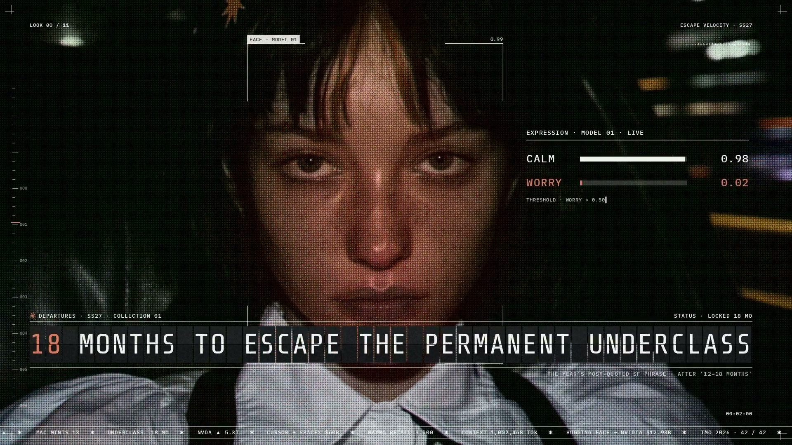

# LLMV_002 · anabology 的 X 视频参考

用户于 2026-10-03 提供 [X 帖子 2103534482930491441](https://x.com/anabology/status/2103534482930491441)，要求下载为第二条独立参考。稳定 ID 为 `LLMV_002`，原片 ID 为 `LLMV_002_SOURCE`；原有 `LLMV_001 / AGI` 的来源、素材、音轨和制作版本各自归属。

本目录仅登记参考素材，`versions/` 暂无制作版本。将来制作时再创建 `v001.0` 并绑定本目录自己的输入，不继承 AGI 的音频、歌词、渲染器或生成 ID。

2026-10-03 按用户歌词请求，另行无损提取完整 [M4A 原音轨](sources/audio/LLMV_002_audio_original_v001.m4a)，原 AAC 数据包与 MP4 内音轨完全一致。已取得作者公开的 `prompts-suno.md`，提取出 [歌词与念白](LYRICS.md) 和 [纯歌词 TXT](sources/text/LLMV_002_lyrics_en_v001.txt)。文本为作者注明的 Suno draft 3 原稿，实际演唱差异见 [带段落时间的核对稿](sources/analysis/transcription-v003/lyrics-timed-source-assisted-v001.md)。

本地 ASR 首轮产生大量重复词，原结果与拒绝记录保留；独立分段识别和密集合唱补查另建分析修订。原稿 Drop 前四行未由两次识别确认，若干代词与副歌用词仍待听辨；时间为自动定位，尚未逐词强制对齐或人工批准。`sources/analysis/transcription-v001` 至 `transcription-v003` 是分析记录，未创建视频制作版本。来源、模型修订、参数、代码和产物哈希均独立登记于本作品。

| 项目 | 内容 |
| --- | --- |
| 显示名称 | anabology · X 视频参考（描述性名称，帖子未提供独立视频标题） |
| 发布者 | anabology / @anabology |
| 来源发布时间 | 2026-09-26 01:17:57，Asia/Shanghai |
| 来源登记 | [project.yaml](project.yaml)、[asset-v001.yaml](sources/asset-v001.yaml) |
| 原片 | [LLMV_002_source_v001.mp4](sources/references/LLMV_002_source_v001.mp4)，仅在本地保留 |
| 规格 | 1920×1080，H.264，24fps，7354 帧 |
| 时长 | 视频 306.416667 秒；容器及音轨 306.480181 秒 |
| 内嵌原音轨 | AAC，44.1kHz，双声道；未裁剪、变速或重新编码 |
| 文件大小 | 353345097 字节，约 337 MiB |
| 原片 SHA-256 | `5a22be4feed3c46051b4a7561ff9a3a8be7fab1ba87966a8c2495c957bae900d` |
| 状态 | review；技术验收通过，未作人工创意批准 |
| 权利 | TBD |

通过 X 的公开 syndication 元数据选择最高码率 MP4，从公开 `video.twimg.com` 地址匿名下载；HTTP 200 的 Content-Length 与实际字节数一致。原片未经转码，完整视频和音频解码通过。内嵌音轨比画面长约 0.064 秒，按来源原样保存。

实际播放的时间从 8.39 秒推进到 43.42 秒；约 92、198、288 秒跳转后均继续播放，`readyState=4`，`error=null`。记录见 [导入验收](sources/provenance/import-v001.json)、[播放验收](sources/provenance/playback-v001.json) 与 [媒体探测](sources/analysis/llmv_002_source_ffprobe_v001.json)。

帖子提及 Opus 5.5、Donald 的提示词、Midjourney 与 moodboard。这些仅为发布者描述，实际模型、提示词、制作过程及资产许可证保持 TBD。原始公开描述保存在 [来源元数据](sources/analysis/source-metadata_v001.json)。

视频继续由根 `.gitignore` 排除。来源、哈希、探测、海报和验收记录独立追踪；技术通过不等同于人工批准。

